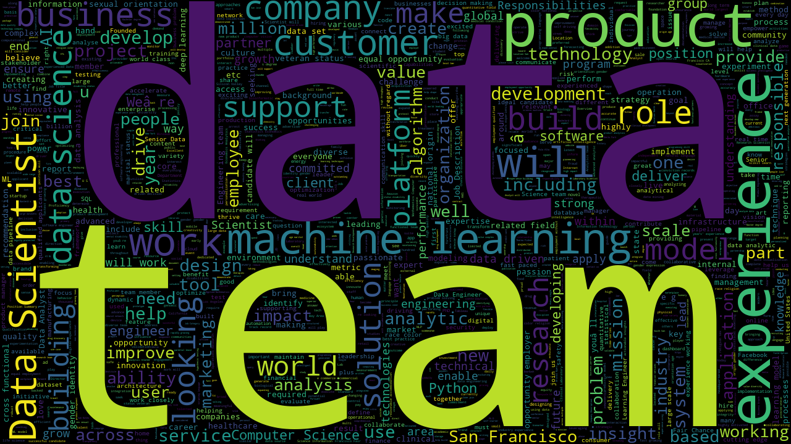
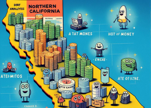

# Proyecto final

## Exploración, limpieza, carga y visualización de datos

---

#### Motivación 🚀

Soy una persona inquieta y curiosa, siempre buscando nuevos horizontes para explorar y desafíos para superar. Esta inquietud me llevó, por ejemplo, a realizar el bootcamp de análisis de datos. Pero mi curiosidad no se detiene ahí. Como amante del mar y la arena 🏖️, y con un espíritu nómada que me lleva a cambiar de ciudad o país de vez en cuando, me pregunté: ¿Cómo sería trabajar en el campo de los datos en el soleado estado de California? Así nació la idea para mi proyecto final: explorar los salarios de los puestos relacionados con el análisis de datos en el *Golden State*. La pregunta que impulsó mi análisis fue: **¿Cuánto podría ganar si trabajara en una de las empresas de datos en California?**

---

#### El viaje 🌍

Mi búsqueda me llevó a [este dataset](https://www.kaggle.com/datasets/vincenttu/glassdoor-joblisting) en Kaggle, que contiene información sobre puestos de trabajo en el campo de los datos publicados en Glassdoor. Sin embargo, el dataset venía con una advertencia: "DISCLAIMER: This dataset is uncleaned and extremely messy!"[1](https://www.kaggle.com/datasets/vincenttu/glassdoor-joblisting). Lejos de desanimarme, vi esto como una oportunidad para poner en práctica mis habilidades recién adquiridas en Python y me embarqué en la tarea de limpieza.

---

#### Herramientas y técnicas 🛠️

Utilicé una variedad de herramientas para la limpieza de los datos. Desde mapeos y la creación de mis propias funciones, hasta el uso de diferentes métodos de Pandas y Numpy. También utilicé librerías como Regex y fuzzywuzzy, y creé visualizaciones con matplotlib y una nube de palabras con la librería wordcloud.

El paso a paso de la limpieza lo puedes encontrar en [este archivo](./notebooks/proyecto%20final.ipynb)

Una vez que los datos estaban limpios, los guardé en un [nuevo CSV](./data/cleaned/joblisting_ok2.csv) y, con la ayuda de sqlalchemy, los almacené en una base de datos creada en DBeaver.

---

#### Visualización de datos 📊

Con los datos limpios y listos para ser utilizados, me sumergí en Power BI para crear un panel de visualización. El resultado es [este dashboard](https://app.powerbi.com/view?r=eyJrIjoiMzQ3NzZmNGMtMTk4NS00NDExLWE1NDgtNTQ0NGEwY2Q2ZmRhIiwidCI6IjQyOGRmZmIwLTZlOWYtNDMxMC04N2U3LWEwODliYzNkYjUzYiIsImMiOjl9) que puedes consultar sin necesidad de tener descargado el programa.

#### Conclusiones 🎯

El dashboard, que estudia 665 empresas diferentes, revela algunas conclusiones interesantes.

Por ejemplo, la media salarial en trabajos del campo de los datos es mucho más alta en el norte de California que en España. Allí, la media es casi 130 mil dólares anuales, mientras que en España es menos de la tercera parte.

Además, casi el 95% de los puestos de trabajo solicitados en Glassdoor son a tiempo completo, dejando un pequeño porcentaje para trabajos a tiempo parcial o contratos.

Por otro lado, se observa que los trabajos más solicitados son científico de datos, ingeniero de Machine Learning y analista de datos.

A partir de la descripción del puesto de trabajo, se extrajeron las herramientas solicitadas (en las descripciones en las que éstas figuraban), y se pudo notar que las tres más pedidas son machine learning, python y SQL.

Te invito a explorar el dashboard y descubrir más sobre el emocionante mundo de los trabajos de análisis de datos en California. ¿Quién sabe? Tal vez te inspire a embarcarte en tu propio viaje de análisis de datos. 🌟
